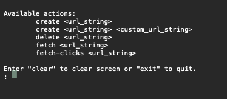

## Adroit Demo Application

This demo is intended to show an implementation of a URL Shortener service. It is a console app written in .NET 8. For persistence I'm using a Json Data Store, which uses Json to mimic a real database. To generate URLs, I'm encoding the sequential DB "primary key" to ensure every short url will be unique. Testing was done with xUnit and Nsubstitute for mocking services.

### Usage Steps 
---
This is a .NET 8 Console Application. It can be run from visual studio for mac or Windows. I myself used VS for Mac, but steps should be similar for Windows:

1. Open Adroit-Demo.sln in Visual Studio
2. Click Start to run the program in your command line.
3. You will see a prompt like this

  

4. Enter any of the available commands followed by a URL, for example `fetch https://tiny.url/123`
5. A response will show below with one of the following outcomes
    * Invalid Input
    * A successful URL value
    * A successful number of clicks
    * Various errors regarding URLs not found
6. You may click clear if your screen gets too busy and you want to clear previous commands
7. Enter "exit" when you're ready to stop the app.

### Unit Testing
---
Unit tests are available for the three major services the app uses. It covers data store functionality, command line promp responses and error handling.

### Potential Improvements
---
1. I believe there may be better ways of configuring my dependency injection in dotnet, similar to how it's done in web apps. However, I haven't really done it in Console applications before and couldn't find a suitable solution.

2. Even though this project does not require a persistence layer, I believe using an in-memory database might work nicely for a demo like this. There are ways of using Entity Framework exclusively for testing, which really tests entity reliability. I still like the Json FlatFile Data Store because it makes it easy to get going, but I had to manually clear my tests to keep the file small. 

3. I tried using the logging extension (ILogger) but was not too satisfied with the way it looked in the command line. I think if I could figure out a better way of logging info/errors without it looking so convoluted, I would consider adding that.

Package References:
* Json Flat File Data Store package: https://github.com/ttu/json-flatfile-datastore
* SqId: https://sqids.org/dotnet
* NSubstitute: https://nsubstitute.github.io/